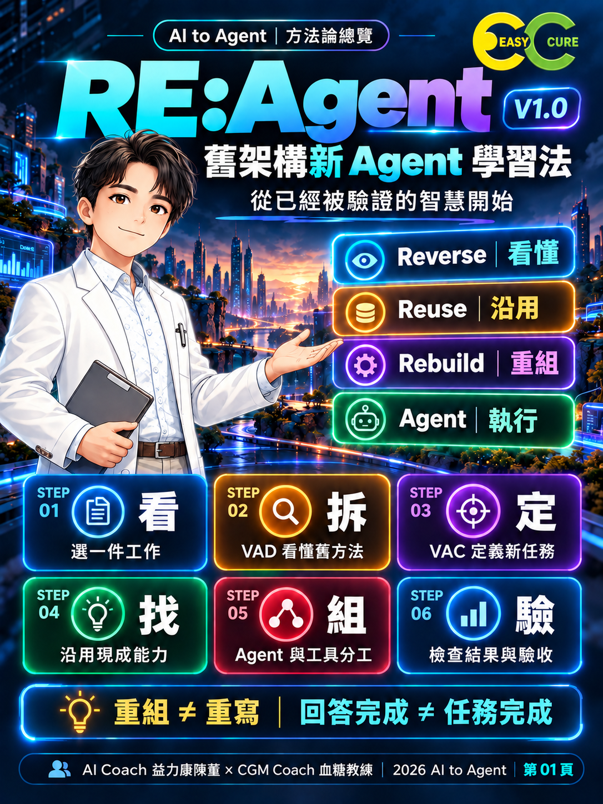

# RE:Agent｜AI to Agent 舊架構新 Agent 學習法

從已經被驗證的智慧開始，讓 AI 真正完成工作。

**Repo：`ai-to-agent-re-agent`｜內容版本：V1.0｜發布版本：1.0.0｜日期：2026-10-06**

內容已定稿；授權為保留所有權利（All rights reserved）。

## 為什麼使用 RE:Agent？

協助教師、學習者與企業團隊看懂既有軟體、App、工作流程與系統中可沿用的智慧，將需求轉成清楚的任務與分工。

## 四個核心動作

**Reverse 看懂 → Reuse 沿用 → Rebuild 重組 → Agent 執行**

## 六步操作

| 步驟 | 核心問題 | 留下的成果 |
|---|---|---|
| STEP 01 看 | 它原本解決什麼問題？ | 原本工作說明 |
| STEP 02 拆 | 它原本如何完成？ | VAD 舊工作拆解圖 |
| STEP 03 定 | Agent 要完成什麼？ | VAC Agent 任務卡 |
| STEP 04 找 | 哪些能力可以沿用？ | 沿用清單 |
| STEP 05 組 | Agent 與工具如何分工？ | 新 Agent 工作圖 |
| STEP 06 驗 | 是否真的完成任務？ | 執行結果與驗收判定 |

**VAD 把舊方法看懂；VAC 把新任務說清楚。**

## 快速開始

不需要安裝程式。先選一件自己用過、輸入輸出看得見、一次能完成的工作。

1. 閱讀[方法論](docs/methodology.md)，依序完成六步。
2. 對照[操作指引](docs/usage.md)，記錄每步成果。
3. 使用[圖卡索引](docs/cards.md)學習或講解。
4. 回到 VAC 完成條件，檢查執行結果；不符合則回到出錯步驟修正。

輸入是一件既有工作的流程與新需求；輸出是六項操作成果。驗收依任務完成、結果正確、工具使用、限制遵守與結果可驗證五項判斷。

## 適用範圍

適用於公開教學、課程教材、企業管理與個人 Agent 任務設計。這是方法論與視覺教材，不是可直接安裝的 Agent、Skill 或執行程式；不提供效能或學習成效保證。本版依作者要求不收錄實測案例，不新增架構或課程。

## 檔案導覽

- [方法論定稿](docs/methodology.md)
- [使用指引](docs/usage.md)
- [8 張知識圖卡索引](docs/cards.md)
- [社群文章完整原稿](docs/social-post.md)
- [品牌與素材來源](docs/brand-assets.md)
- [發布設定與步驟](docs/publishing.md)
- [Release Notes](docs/release-notes.md)
- [檢查紀錄](docs/validation.md)
- [版本紀錄](CHANGELOG.md)
- [貢獻規範](CONTRIBUTING.md)
- [授權狀態](LICENSE)

## 版本與後續維護

方法論 V1.0 對應發布版本 1.0.0，預定 tag 為 v1.0.0。六步與四個核心動作固定；後續僅依已確認需求修正文案、排版與一致性，不預告未實作功能。

## 授權與版權

本 repo 採保留所有權利（All rights reserved），見 [LICENSE](LICENSE)，不是開源授權；法律權利人為 AI Coach 益力康陳董。品牌署名不等於第三方素材權利的認定；Logo、人物形象與圖卡的使用範圍另見[素材說明](docs/brand-assets.md)。

---

AI Coach 益力康陳董 x CGM Coach 血糖教練 | 2026 AI to Agent
