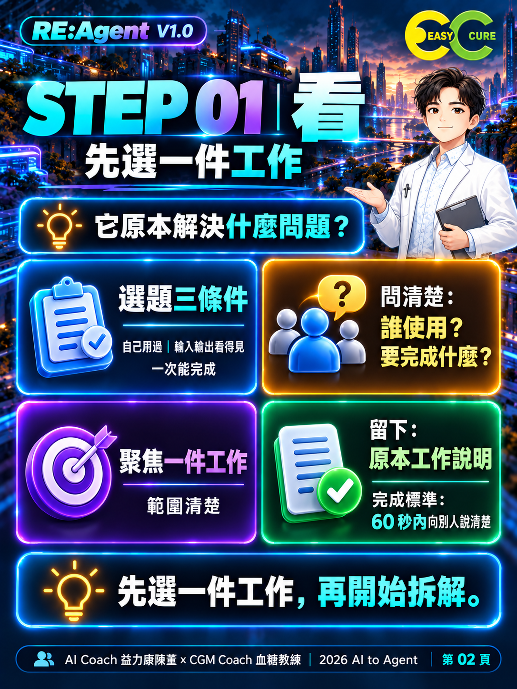
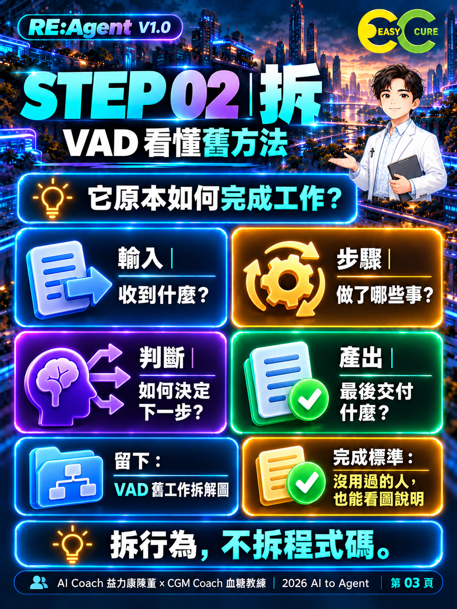
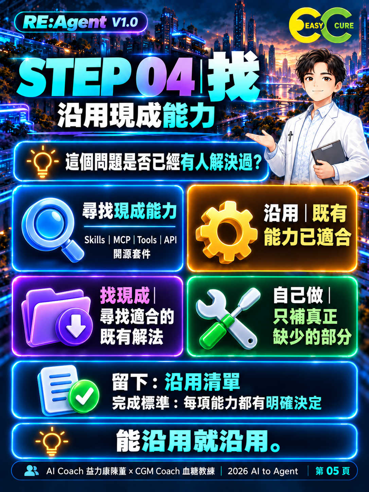
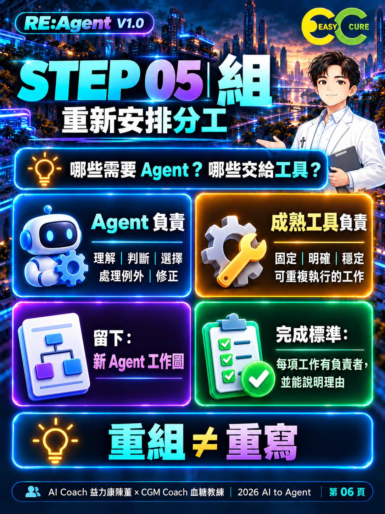
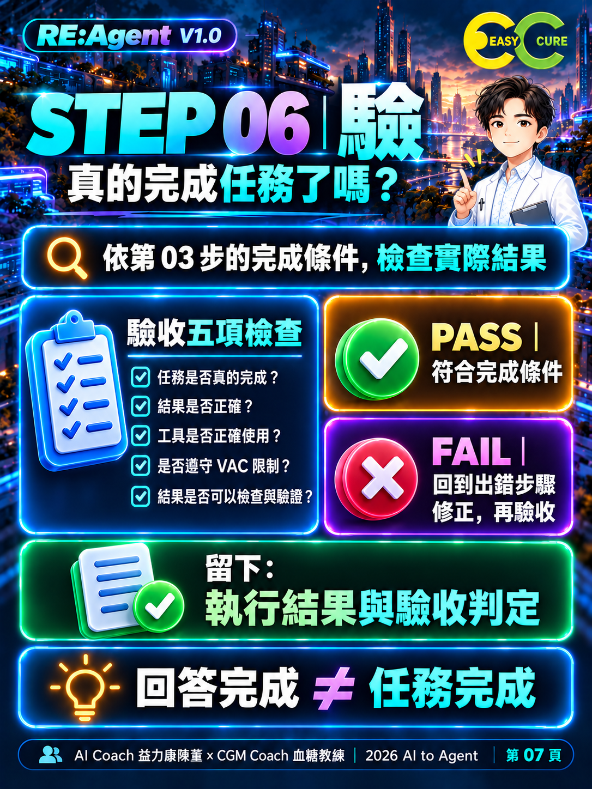
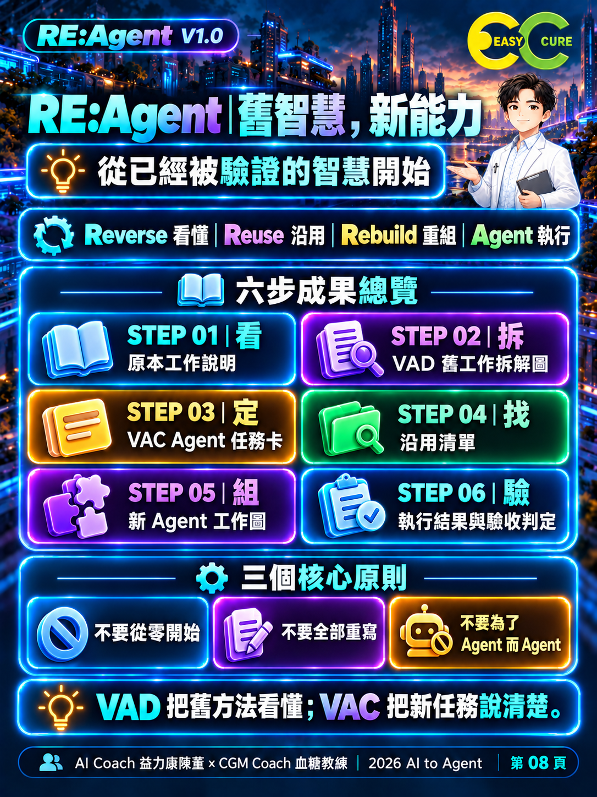

# 知識圖卡索引

風格：霓曜智城｜3D 玻璃科技。頁碼使用「第 XX 頁」，步驟使用「STEP XX」。

## 第 01 頁｜封面總覽

## 第 02 頁｜看：先選一件工作

## 第 03 頁｜拆：VAD 看懂舊方法

## 第 04 頁｜定：VAC 說清楚新任務

## 第 05 頁｜找：沿用現成能力

## 第 06 頁｜組：重新安排分工

## 第 07 頁｜驗：真的完成任務了嗎？

## 第 08 頁｜方法論總結

---

AI Coach 益力康陳董 x CGM Coach 血糖教練 | 2026 AI to Agent
